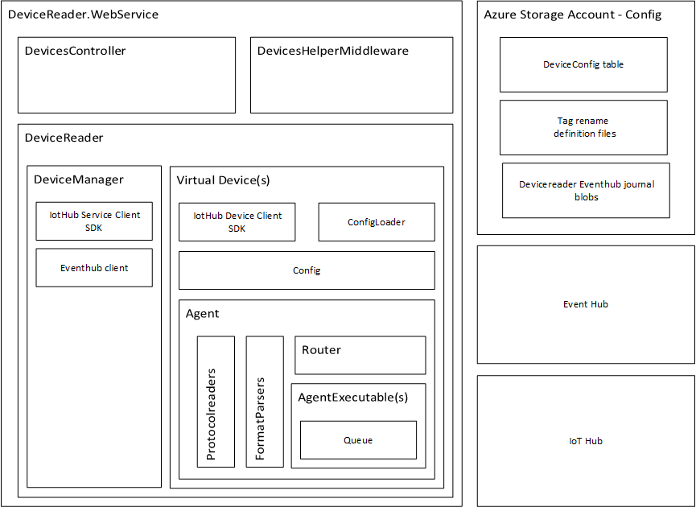

# Architecture

Currently solution is built with Azure and its IoTHub as backend service. 

Iot Gateway components

**DeviceManager** - Each gateway consists Devicemanager which reads device configurations from IoT Hub registry.
*DeviceManager* starts and stops virtual devices. Device manager also listens to Eventhub which publishes device lifecycle and 
configuration change messages. 

**Virtual Device** - Each virtual device consists IoTHub SDK client, ConfigLoader, Config and Agent. When Devicemanager 
creates instance of virtual device, device loads device Twin from IotHub and determines which config it should load. 
ConfigLoader then loads configuration from specified sources and if enabled, starts device *Agent*.

**Agent** - is basically set of *AgentExecutable* tasks which execute in parallel. Each AgentExecutable has *queue* to which 
it receives messages for processing. *Agent* also has access to *Protocolreaders* and *FormatParsers* which help to interact 
with legacy devices and transform their data format into standardized observations.

**AgentExecutable** - is task in Agent with specific type. 

**Queue** - is queue where AgentExecutable is receiving messages for processing. Currently, queue has no persistance but this 
is easily solvable by swapping out current interface implementation of queue with persitent-store queue implementation.

**DeviceController** - is ASP.NET Core api controller for querying gateway about current status of virtual devices. 
It listens on *https://Gatewayaddress/api/devices* URI.

** DevicesHelperMiddleware** - is ASP.NET Core custom middleware to provide each device inbound authentication customization

## Notes on architecture

While it is certainly possible to read legacy devices telemetry in a simpler way, for example without providing each device its own 
IoT Hub identity, decision was made to provide each legacy device with device identity, mostly because if new type of devices
which support device identity out of the box are introduced to data gathering system, not much is required to accommodate them.

Decision to use queues and not pipes for processing stemmed from risk that IoTHub connection from device to IoT Hub might go down,
losing telemetry not yet sent to upstream. Of course, to fully support message persistance, queue implementation needs to be changed 
to support persitance. Queus also give opportunity to batch upstream messages together and throttle upstream messages sending rate if 
needed.

Decision not to use [Azure IoT Edge](https://docs.microsoft.com/en-us/azure/iot-edge/) and its modules concept was blocked by
fact, that at time, IoT Edge had up to 10 modules identity support, so when I needed each device to have identity in IoT Hub, this
was not satisfying requirements.

## Future development

### Other platforms

It should be possible to rewrite/extend components to use AWS, GCP, etc or private cloud instead. Throughout project, I've tried to 
use Inversion of Control (IoC) as much as possible to simplify this goal in future.

### Azure IoT Edge

As [Azure IoT Edge](https://docs.microsoft.com/en-us/azure/iot-edge/) develops, this architecture might transform
to be more compatible with Edge modules/child devices concept. First milestone might be allow virtual device run 
independetly of DeviceManager so it can run as independent docker module. It then will be docker/kubernetes management 
layer responsibility to ensure that only one instance of device is run at one time anywhere in cluster.

## Tests

There are not nearly as many tests as there should be. As project matures, this should change. First and foremost will be unit tests
for legacy systems protocols and data formats. 